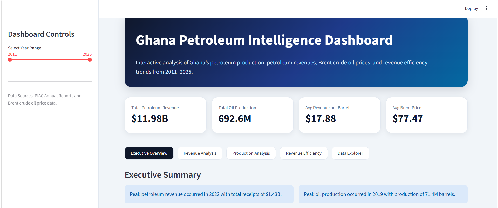

# Ghana Petroleum Intelligence Platform

## Overview

This project analyzes Ghana’s petroleum production, petroleum revenues, Brent crude oil prices, and revenue efficiency trends using publicly available government petroleum reports and global oil market data.

The project demonstrates an end-to-end analytics workflow including:
- data ingestion
- data cleaning
- transformation
- exploratory data analysis (EDA)
- interactive dashboard development
- business insight generation

---

## Business Problem

Ghana’s petroleum sector is heavily influenced by:
- global oil price volatility
- production dynamics
- petroleum revenue efficiency

This project aims to explore:
- how petroleum revenues changed over time
- how production trends evolved
- how Brent crude prices influenced petroleum earnings
- whether Ghana earned more or less revenue per barrel over time

---

## Data Sources

### Ghana Petroleum Data
- Public Interest and Accountability Committee (PIAC) Annual Reports

### Brent Crude Oil Prices
- U.S. Energy Information Administration (EIA)

---

## Technologies Used

- Python
- Pandas
- Plotly
- Streamlit
- Jupyter Notebook
- VS Code

---

## Project Structure

```text
ghana-petroleum-data-pipeline/
│
├── dashboard/
│   └── app.py
│
├── data/
│   ├── raw/
│   └── processed/
│
├── notebooks/
│   └── ghana_petroleum_eda.ipynb
│
├── src/
│   └── transform/
│
├── assets/
│
├── requirements.txt
├── README.md
└── .gitignore
```

---

## Dashboard Features

- Executive KPI metrics
- Revenue trend analysis
- Production trend analysis
- Revenue efficiency analysis
- Brent crude price comparison
- Interactive filtering
- Downloadable datasets

---

## Key Insights

- Petroleum revenues were highly sensitive to global oil market cycles.
- Oil production peaked in 2019 before gradually declining.
- Revenue per barrel strongly tracked Brent crude prices.
- 2022 recorded the strongest petroleum revenue environment in the dataset.
- Revenue efficiency remained relatively strong in 2024 despite lower Brent crude prices.

---

## Dashboard Preview

### Executive Dashboard



### Revenue Analysis

Add revenue screenshot here.

### Production Analysis

Add production screenshot here.

---

## Future Improvements

- Add DuckDB warehouse layer
- Add SQL analytics
- Automate PDF extraction
- Add forecasting models
- Add field-level production analysis
- Deploy dashboard to cloud

---

## Installation

Clone repository:

```bash
git clone https://github.com/kale2861/ghana-petroleum-data-pipeline.git
```

Install dependencies:

```bash
pip install -r requirements.txt
```

Run Streamlit dashboard:

```bash
python -m streamlit run dashboard/app.py
```

---

## Author

Sena Kaledzi

MS Data Science Graduate